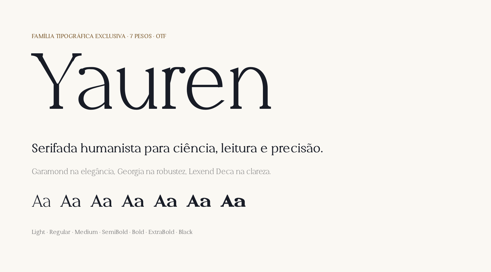
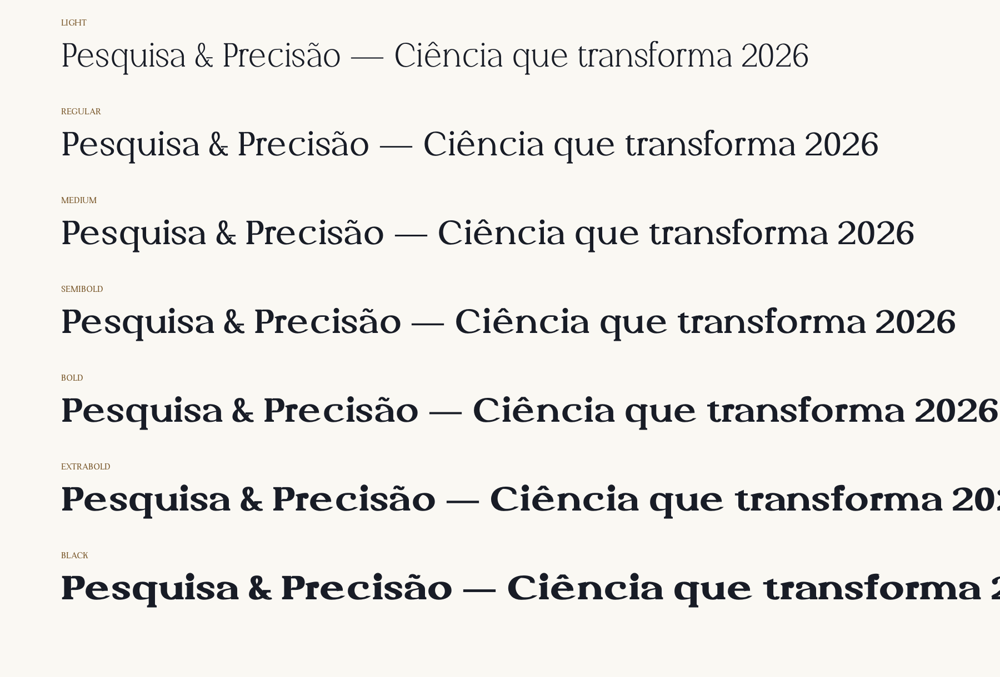
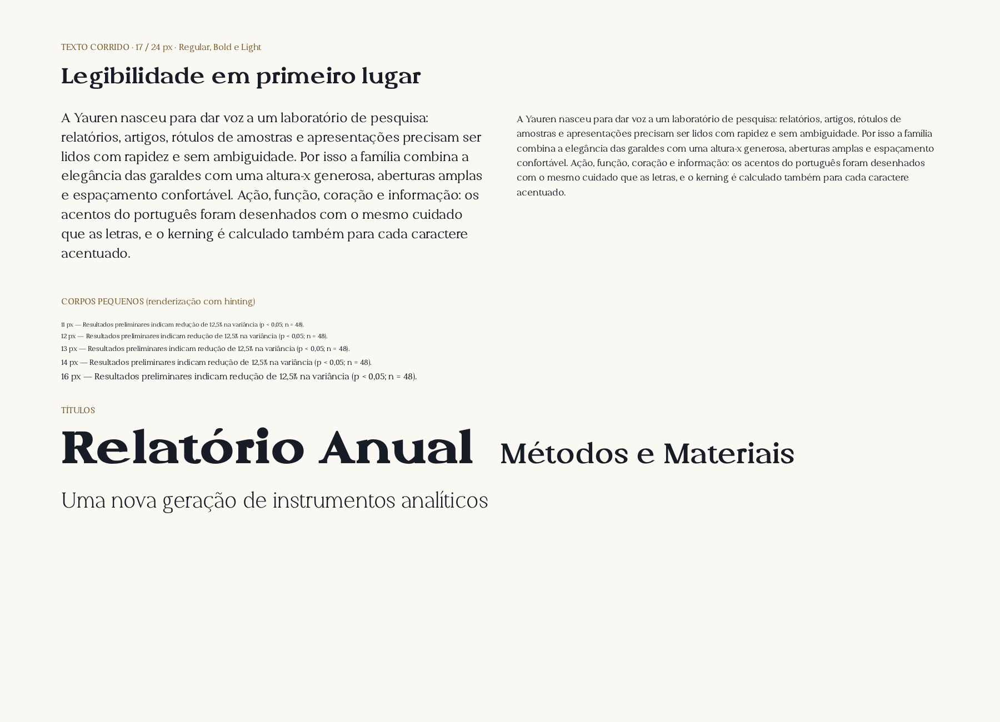
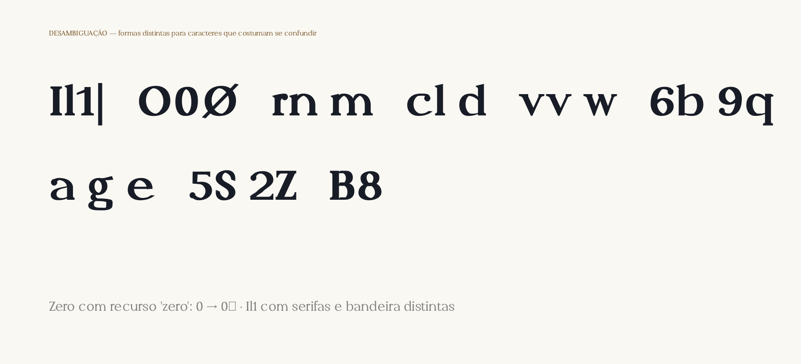
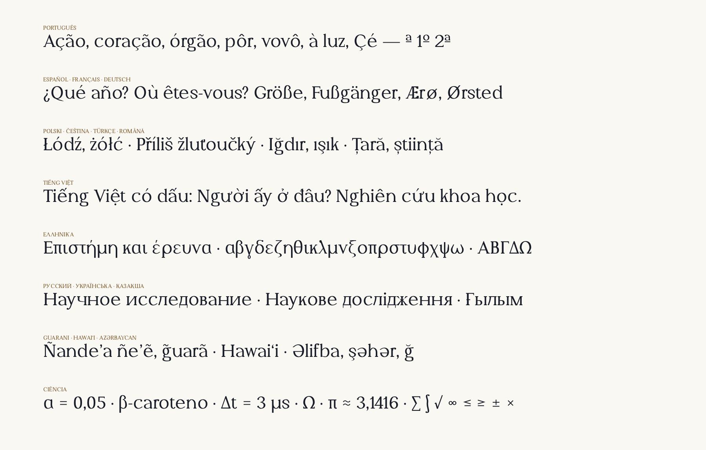
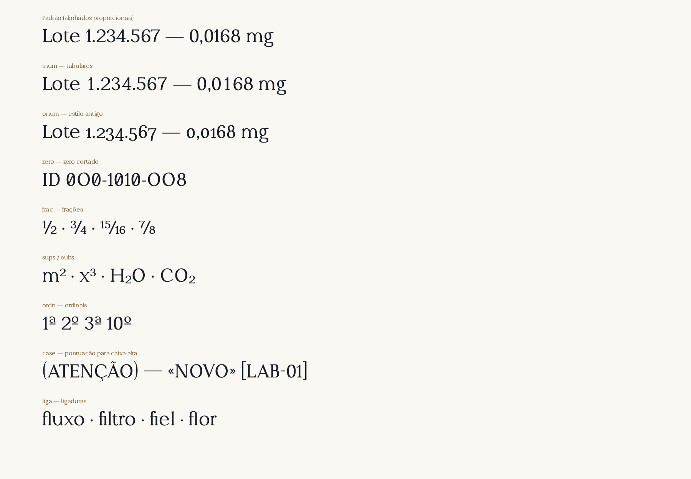
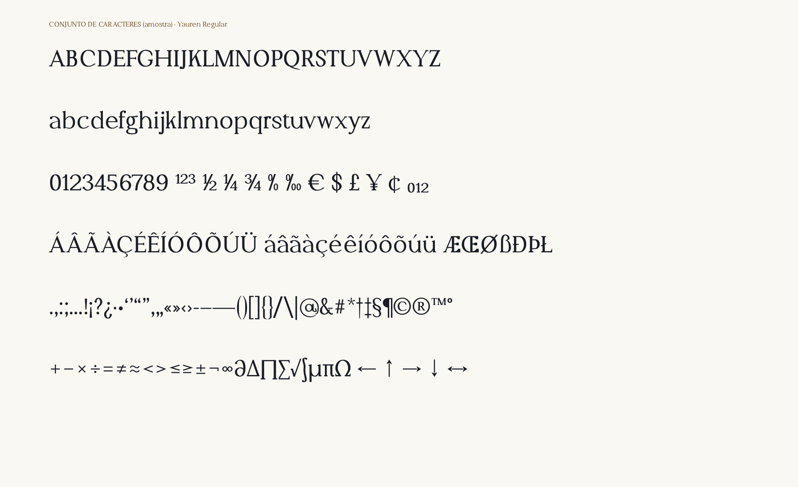

# Yauren

**Família tipográfica exclusiva da Yauren** — serifada humanista em **7 pesos** (Light → Black, sem itálicos), entregue em **OTF (OpenType/CFF)**, com versões **WOFF2** para web.

Criada para um laboratório de pesquisa: relatórios, artigos, rótulos de amostras, tabelas de dados, sinalização e apresentações. Fácil de ler, elegante e atemporal — com identidade própria.



---

## Arquivos

| Peso | Classe CSS / OS2 | Arquivo OTF | Web |
|---|---|---|---|
| Light | 300 | `fonts/otf/Yauren-Light.otf` | `fonts/webfonts/Yauren-Light.woff2` |
| Regular | 400 | `fonts/otf/Yauren-Regular.otf` | `fonts/webfonts/Yauren-Regular.woff2` |
| Medium | 500 | `fonts/otf/Yauren-Medium.otf` | `fonts/webfonts/Yauren-Medium.woff2` |
| SemiBold | 600 | `fonts/otf/Yauren-SemiBold.otf` | `fonts/webfonts/Yauren-SemiBold.woff2` |
| Bold | 700 | `fonts/otf/Yauren-Bold.otf` | `fonts/webfonts/Yauren-Bold.woff2` |
| ExtraBold | 800 | `fonts/otf/Yauren-ExtraBold.otf` | `fonts/webfonts/Yauren-ExtraBold.woff2` |
| Black | 900 | `fonts/otf/Yauren-Black.otf` | `fonts/webfonts/Yauren-Black.woff2` |

Regular e Bold formam o par "estilo vinculado" (Ctrl+B nos aplicativos); os demais pesos aparecem
como estilos da família **Yauren** em aplicativos modernos (nomes tipográficos 16/17) e como
famílias separadas ("Yauren Light", "Yauren Black"…) em aplicativos antigos.



---

## Conceito de desenho

| Referência | O que a Yauren herdou |
|---|---|
| **Garamond** | Proporções clássicas, serifas de cabeça em cunha, eixo de contraste levemente inclinado (8°), terminais em gota, `a` e `g` de dois andares, cauda longa do `Q`. |
| **Georgia** | Robustez para tela: altura-x grande, traços finos que não desaparecem (contraste moderado ≈ 0,42), serifas com colchete firme, terminais em bola, algarismos sólidos. |
| **Lexend Deca** | Clareza e conforto: formas mais largas, aberturas amplas (`c e s a`), espaçamento generoso, desenho sem ambiguidades. |

Traços próprios da Yauren: serifas de pé com colchete em filete contínuo, pequenas serifas verticais
nos terminais de `s S C G`, `Y` com braços de contraste marcado (a inicial da marca), `Q` com cauda
caligráfica, `ç`/`ã`/`õ` desenhados como parte do sistema e não como acréscimo.

### Legibilidade universal (decisões de projeto)

* **Altura-x de 50% do corpo** (500/1000) — letras maiores no mesmo corpo, boas em 9–12 pt.
* **Aberturas amplas** e **contraste moderado**: resistem a impressão de baixa qualidade, projeção e telas.
* **Desambiguação**: `I l 1 |` distintos; `0` oval × `O` redondo (+ zero cortado opcional); `rn` ≠ `m`; `cl` ≠ `d`.
* **Espaçamento óptico** (redondas medidas do extremo da curva, retas da ponta da serifa) e
  **kerning** calculado para todos os pares críticos, inclusive acentuados (`Tô`, `Vá`, `Fé`).
* **Hinting PostScript** (afdko `otfautohint`) para nitidez em telas Windows em corpos pequenos.




---

## Cobertura de idiomas

**814 glifos · 728 caracteres** — latim (inclusive vietnamita), grego monotônico e cirílico.
Verificação com *hyperglot*: **376 idiomas, ≈ 3,04 bilhões de falantes**.

* **Português completo** (á â ã à ç é ê í ó ô õ ú ü, ª º), espanhol, francês, alemão (ß ẞ), italiano,
  catalão, todos os idiomas da Europa Ocidental, Central e do Norte, turco, azerbaijano, romeno (ș ț),
  polonês, tcheco, húngaro, bálticos, nórdicos (Æ Ø Þ Ð), galês, vietnamita, guarani (ẽ ĩ ỹ g̃ ʼ),
  havaiano (ʻ), dezenas de idiomas africanos e indígenas das Américas (marcas combinantes).
* **Grego** (incl. tonos e dialítica) — essencial para notação científica: α β γ δ λ μ π σ Ω Δ.
* **Cirílico**: russo, ucraniano, bielorrusso, búlgaro, sérvio, macedônio, cazaque, tártaro, quirguiz, mongol…
* **Símbolos científicos e técnicos**: ± × ÷ − = ≠ ≈ ≤ ≥ ∞ ∂ ∆ ∏ ∑ √ ∫ µ ‰ ° № ← ↑ → ↓ ↔, frações,
  sobrescritos/subscritos (¹²³ ⁴…⁹ ₀…₉), moedas (R$ $ € £ ¥ ¢ ¤).



---

## Recursos OpenType

| Recurso | Efeito | CSS |
|---|---|---|
| `kern` | Kerning (ativo por padrão) | — |
| `liga` | Ligaduras fi, fl | — |
| `tnum` | Algarismos tabulares (tabelas, dados) | `font-variant-numeric: tabular-nums` |
| `onum` / `lnum` | Algarismos de estilo antigo / alinhados | `oldstyle-nums` / `lining-nums` |
| `pnum` | Algarismos proporcionais (padrão) | `proportional-nums` |
| `zero` | Zero cortado (códigos de amostra, IDs) | `font-variant-numeric: slashed-zero` |
| `frac` | Frações automáticas (1/2 → ½) | `diagonal-fractions` |
| `sups` / `subs` / `sinf` | Sobrescritos e subscritos (m², H₂O) | `font-variant-position: super / sub` |
| `numr` / `dnom` | Numeradores / denominadores | `font-feature-settings: "numr"` |
| `ordn` | Ordinais (1a → 1ª, 2o → 2º) | `font-variant-numeric: ordinal` |
| `case` | Pontuação ajustada para CAIXA-ALTA | `font-feature-settings: "case"` |
| `locl` | Romeno/moldavo (Ş→Ș), catalão (l·l) | `lang="ro"`, `lang="ca"` |
| `ccmp`, `mark`, `mkmk` | Acentos combinantes, empilhamento (vietnamita), i/j sem pingo | — |



---

## Instalação

* **Windows**: selecione os 7 `.otf` → botão direito → *Instalar para todos os usuários*.
* **macOS**: abra cada `.otf` no *Catálogo de Fontes* → *Instalar*.
* **Linux**: copie para `~/.local/share/fonts/` e rode `fc-cache -f`.
* **Web**: publique `fonts/webfonts/` e importe `yauren.css`:

```css
@import url("fonts/webfonts/yauren.css");
body  { font-family: "Yauren", Georgia, serif; line-height: 1.55; }
table { font-variant-numeric: tabular-nums; }
```

Recomendações de uso: **Regular 400** para texto corrido (9–12 pt impresso, 16–20 px em tela),
**Light** para títulos grandes, **SemiBold/Bold** para destaques e interfaces, **Black** apenas para
chamadas e títulos curtos. Entrelinha confortável: 1,4–1,6.

---

## Especificações

| | |
|---|---|
| Formato | OpenType CFF (`.otf`), com hinting; WOFF2 para web |
| Unidades por eme | 1000 |
| Altura-x / Maiúsculas / Ascendente / Descendente | 500 / 680 / 740 / −235 |
| Algarismos alinhados | 660 |
| Métricas verticais | hhea/typo 960 / −300 (`USE_TYPO_METRICS`), win 967 / 376 — iguais em todos os pesos |
| Hastes (n) Light → Black | 58 · 84 · 100 · 119 · 139 · 160 · 182 |

Medições completas por peso: [`docs/metricas.md`](docs/metricas.md).
Relatório de controle de qualidade: [`docs/QA.md`](docs/QA.md).
Espécime para navegador: [`docs/especime.html`](docs/especime.html).



---

## Código-fonte e reconstrução

A Yauren é desenhada de forma **paramétrica** (em Python): cada letra é um esqueleto traçado por uma
pena elíptica virtual, com serifas, terminais e junções construídos geometricamente; os 7 pesos
derivam do mesmo desenho com parâmetros por peso (hastes, finos, serifas, contraformas, espaçamento).
Isso garante consistência total entre pesos e permite ajustes globais (ex.: altura-x, contraste,
serifas) com uma alteração.

```
source/yauren/        motor (geometria, pena, booleanas, montagem OTF, kerning, recursos)
source/yauren/glyphs/ desenho dos glifos (minúsculas, maiúsculas, algarismos, símbolos, grego, cirílico…)
tools/                provas, espécimes e relatório de QA
build.sh              reconstrói tudo
```

```bash
./build.sh                 # todos os pesos
./build.sh 400 700         # apenas Regular e Bold
```

---

## Licença

Fonte **proprietária e exclusiva** da Yauren — todos os direitos reservados. Uso, distribuição e
incorporação restritos à Yauren e a quem ela autorizar. Os termos estão gravados nos metadados das
fontes (campos *Copyright* e *License Description*). Recomenda-se revisão jurídica do texto de
licença antes de distribuição externa.
